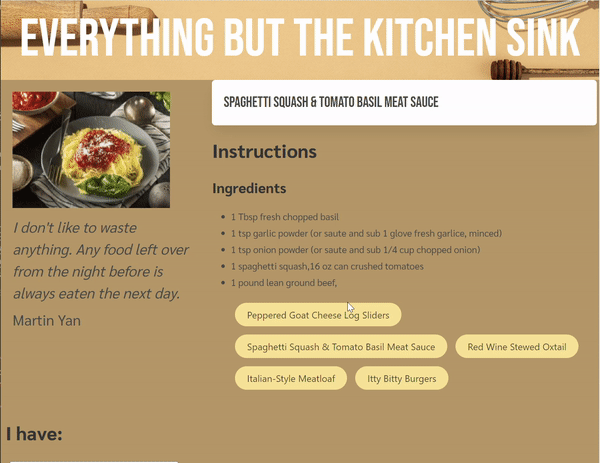

# 07 Project 1: Interactive Front-End Application

## Description

This project required us developers to work collaboratively on a project to solve a real-world problem. We implemented a user story and mock-up as a guidline to develop an app that allows the user to input ingredients that they have on hand and the app will five recipe buttons with suggested recipes based on user ingredient submission. The user can then click the recipe button to generate an image, ingredients required, and detailed instructions on preparation. The app features two APIs, one for recipe generation and another for food related quotes.

## Tasks 

- Implemented Spoonacular API to render recipe image, ingredients and instructions.
- Implemented API Ninja to display a random food-based quote.
- The app was styled using Bulma CSS framework.
- Worked collaboratively with a group of three developers.
- Used issues on a kanban project board and branches to delegate work.
- Implemented local storage to store the last five recipes the user generated.

## Demo

## Links
Deployed Webpage: https://rambriz91.github.io/kitchen-repo/
GitHub Repo Page: https://github.com/rambriz91/kitchen-repo

## Credits

- https://bulma.io/documentation/
- https://spoonacular.com/food-api/docs
- https://api-ninjas.com/api

## Collaborators

- Rob Ambriz | https://github.com/rambriz91
- Jorge Gonzalez | https://github.com/1014jorge
- David Nunez Lopez | https://github.com/nunezzdavid

## License

MIT License

Copyright (c) [2023] [Robert Ambriz, Jorge Gonzalez, David Nunez Lopez]

Permission is hereby granted, free of charge, to any person obtaining a copy
of this software and associated documentation files (the "Software"), to deal
in the Software without restriction, including without limitation the rights
to use, copy, modify, merge, publish, distribute, sublicense, and/or sell
copies of the Software, and to permit persons to whom the Software is
furnished to do so, subject to the following conditions:

The above copyright notice and this permission notice shall be included in all
copies or substantial portions of the Software.

THE SOFTWARE IS PROVIDED "AS IS", WITHOUT WARRANTY OF ANY KIND, EXPRESS OR
IMPLIED, INCLUDING BUT NOT LIMITED TO THE WARRANTIES OF MERCHANTABILITY,
FITNESS FOR A PARTICULAR PURPOSE AND NONINFRINGEMENT. IN NO EVENT SHALL THE
AUTHORS OR COPYRIGHT HOLDERS BE LIABLE FOR ANY CLAIM, DAMAGES OR OTHER
LIABILITY, WHETHER IN AN ACTION OF CONTRACT, TORT OR OTHERWISE, ARISING FROM,
OUT OF OR IN CONNECTION WITH THE SOFTWARE OR THE USE OR OTHER DEALINGS IN THE
SOFTWARE.